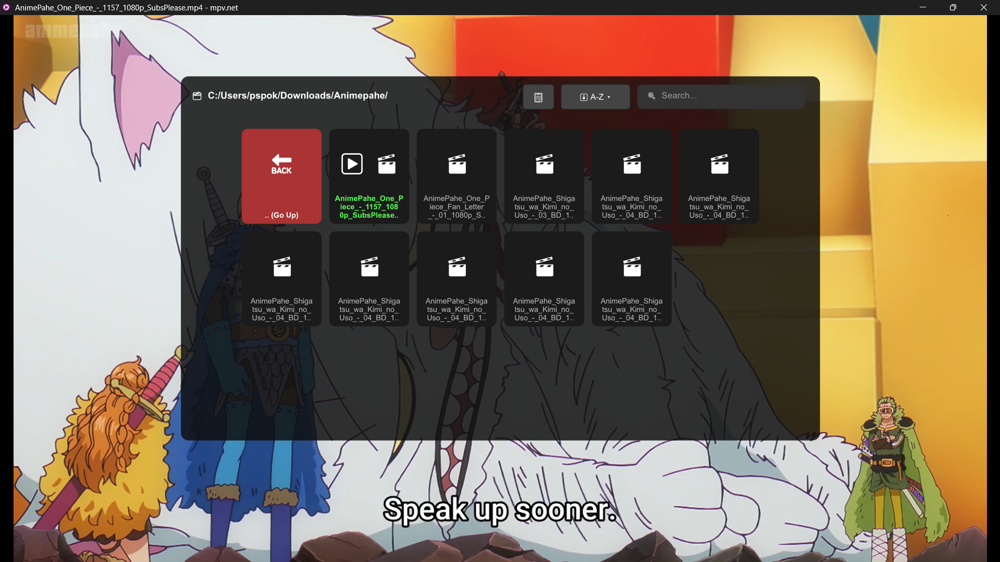
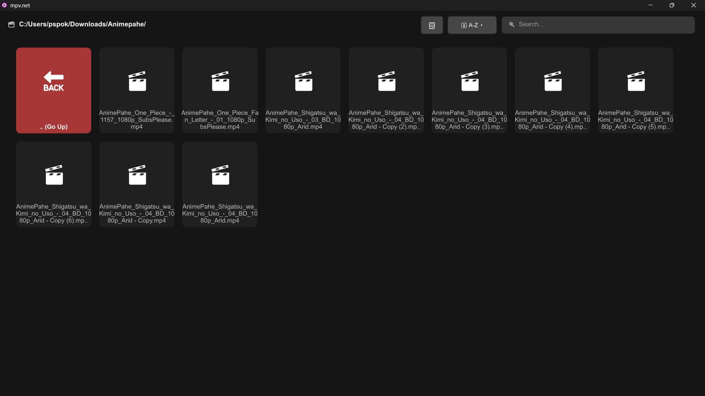
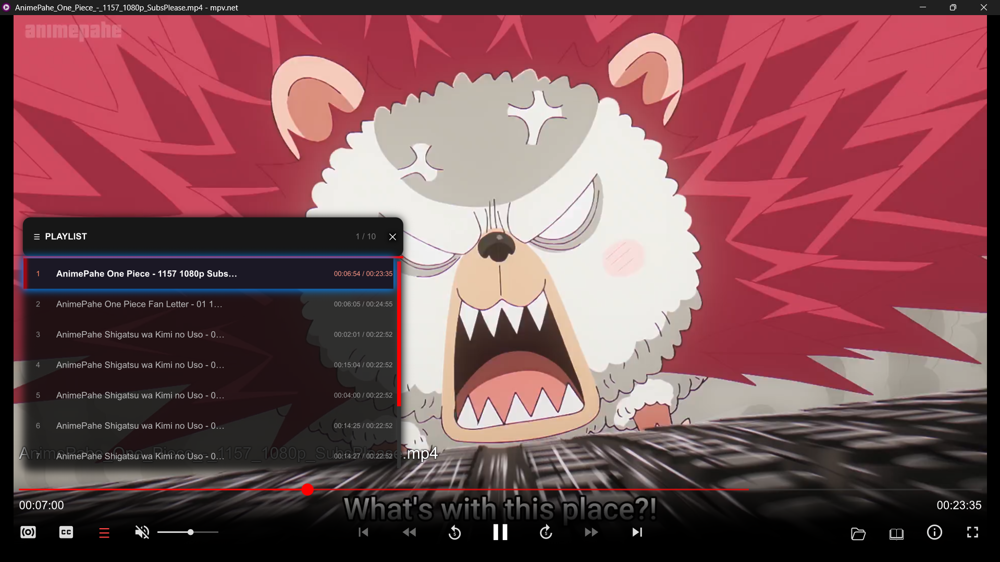
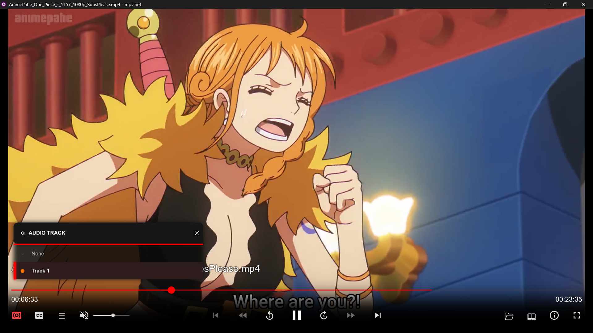
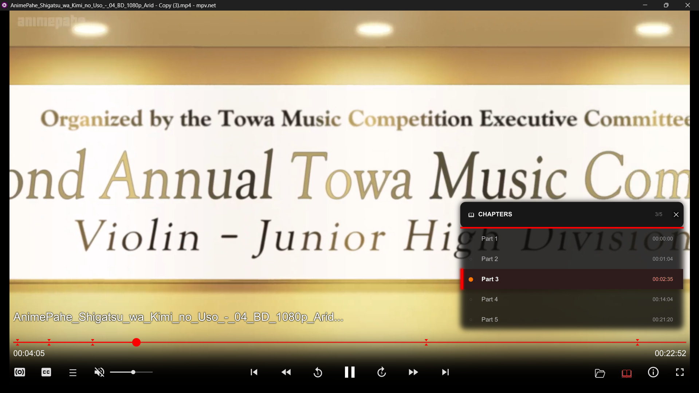

# mpv-modernP
A highly optimized, battery-friendly OSC and File Browser for MPV player. Built for zero background processing and seamless binging.

# ModernP

A minimal, resource-efficient On-Screen Controller (OSC) and custom UI for the MPV media player. 

Forked from [maoiscat/mpv-osc-modern](https://github.com/maoiscat/mpv-osc-modern) and [cyl0/ModernX](https://github.com/cyl0/ModernX), this version is optimized for minimum background processing and maximum battery efficiency.

## Features

### File Browser Overlay
Navigate local directories directly within MPV. Supports Grid and List views, sorting (A-Z, Date), and an instant typing-based search.

### Playlist Overlay
View and manage your current queue with visual progress tracking. Includes green checkmarks (`✓`) for completed files and watched timestamps.

### Audio & Subtitle Overlays
Clean, native menus to quickly cycle through or select specific audio and subtitle tracks without cluttering the interface.

### Chapters Overlay
Navigate through video chapters with a dedicated menu showing precise timestamps for each segment.

## 📥 Installation (For mpv.net - Portable Mode)

This setup is specifically optimized for **mpv.net** (`mpvnet.exe`), a modern Windows fork of MPV. To keep your system clean, we highly recommend using the portable mode.

1. **Get mpv.net:** If you don't have it, download the latest version of [mpv.net from GitHub](https://github.com/mpvnet-player/mpv.net/releases) and extract it to a folder of your choice.
2. **Open the Folder:** Go to your main mpv.net installation folder (the exact folder where your `mpvnet.exe` is located).
3. **Make it Portable:** Create a new folder inside it and name it exactly: `portable_config`
4. **Download the Setup:** Download the provided setup ZIP file from this repository.
5. **Extract:** Extract all the contents of the ZIP file directly into the newly created `portable_config` folder.
6. **Done!** Launch `mpvnet.exe`. The ModernP UI along with all God-Tier battery-saving settings will automatically take over.

*(Note: If you already use mpv.net, ensure you delete any existing `osc.conf` from your `script-opts` folder before applying this setup to avoid clashes.)*

## Key Bindings

| Key | Action |
| --- | --- |
| **`O`** | Toggle File Browser |
| **`TAB`** | Toggle Playlist |
| **`C`** | Toggle Chapters Menu |
| **`A`** / `Shift+A` | Cycle / Toggle Audio Tracks Menu |
| **`S`** / `Shift+S` | Cycle / Toggle Subtitle Tracks Menu |
| **`Arrows` / `Scroll`** | Navigate through menus and grids |
| **`ENTER` / `Click`** | Play selected file or open folder |
| **`Typing`** *(in Browser)* | Instantly search/filter files and folders |

## Credits
* [maoiscat](https://github.com/maoiscat/mpv-osc-modern) - Original creator of *mpv-osc-modern*.
* [cyl0](https://github.com/cyl0/ModernX) - Creator of the *ModernX* fork.
* [Karan1155](https://github.com/Karan1155-op) - Creator of *ModernP* (Refactoring, Overlay integration, and battery optimization).
